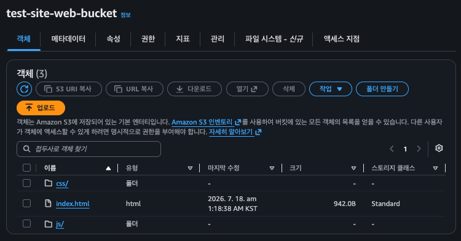
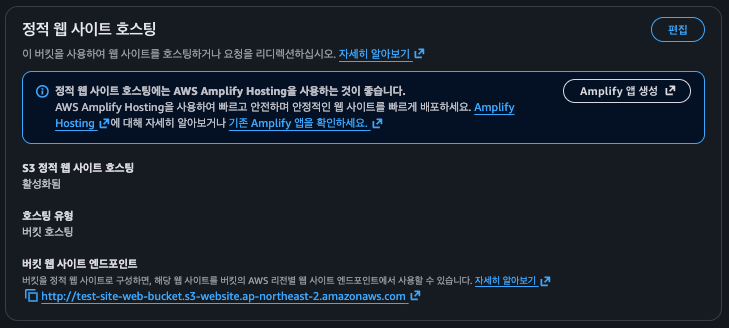
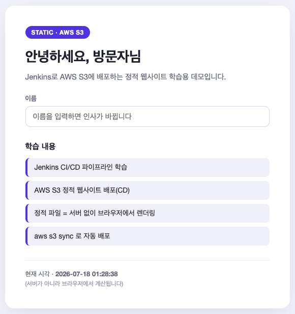

## AWS CLI 설치 방법(Docker Hub에 업로드된 이미지 기반)

* **[amazon/aw-cli - Docker Image](https://hub.docker.com/r/amazon/aws-cli)**
* AWS CLI는 명령어를 통해 동작하는데 해당 명령어에 대한 내용은 다음 레퍼런스를 참고한다.
* **[aws - AWS CLI 2.34.16 Command Reference](https://docs.aws.amazon.com/cli/latest/reference/)**
* 참고로 해당 문서는 최신 버전 기준이라 사용했다. 차후에 다른 버전이 릴리즈되면 그 버전을 다시 참고해야한다.

## AWS CLI로 S3 버킷 가져오기

* [s3 - AWS CLI 2.34.20 Command Reference](https://docs.aws.amazon.com/cli/latest/reference/s3/)
* [ls - AWS CLI 2.34.14 Command Reference](https://docs.aws.amazon.com/cli/latest/reference/s3/ls.html)
* `ls` 명령어는 일반적으로 리눅스에서도 `list`의 줄임말로 현재 위치나 특정 경로 디렉터리 내용의 목록을 출력하는데 이 명령어를 이용하면 S3 버킷의 목록을 가져올 수 있다.

```json
{
  "Version": "2012-10-17",
  "Statement": [
    {
      "Sid": "ListTheBucket",
      "Effect": "Allow",
      "Action": "s3:ListBucket",
      "Resource": "arn:aws:s3:::내버킷이름"
    },
    {
      "Sid": "ReadWriteObjects",
      "Effect": "Allow",
      "Action": [
        "s3:GetObject",
        "s3:PutObject",
        "s3:DeleteObject"
      ],
      "Resource": "arn:aws:s3:::내버킷이름/*"
    }
  ]
}
```



## Jenkins에 AWS 자격증명 추가

* `Kind` : Username with password
    * `Username` : Access Key ID
    * `Password` : Secret Access Key
    * `ID` : credentialsId(ex. 'my-aws')
* `Secret text` : s3-bucket-name(ex. 'test-site-web-bucket')

## Jenkins를 활용해 S3에 파일 업로드하기 / 버킷명 환경변수로 등록하기

* [cp - AWS CLI 2.34.21 Command Reference](https://docs.aws.amazon.com/cli/latest/reference/s3/cp.html)

## Jenkins와 S3를 활용해 정적 웹 사이트 호스팅



* 다음과 같은 문제가 발생한다. 그 이유는 버킷에 정책을 추가하지 않았기 때문이다.
* 정책(Policy)이란 권한(Permission)을 정의하는 JSON 문서를 의미한다. AWS는 기본적으로 대부분의 권한이 주어져 있지 않다.
* AWS의 특정 소스에 접근하려면 권한을 허용해 주어야 한다. 이 때, 최소 권한만을 허용해주는 것이 보안상 좋다.

```json
{
    "Version": "2012-10-17",
    "Statement": [
        {
            "Sid": "PublicReadGetObject",
            "Effect": "Allow",
            "Principal": "*",
            "Action": "s3:GetObject",
            "Resource": "arn:aws:s3:::내버킷이름t/*"
        }
    ]
}
```



## AWS CLI로 S3 파일 동기화

* [sync - AWS CLI 2.34.16 Command Reference](https://docs.aws.amazon.com/cli/latest/reference/s3/sync.html)
* 배포를 진행할 때마다, 버킷을 수동으로 비워야 하고 새로운 파일을 버킷에 추가해야 한다.
* 이런 작업을 보다 쉽게 수행하기 위해 S3에서 `sync` 기능을 제공한다.